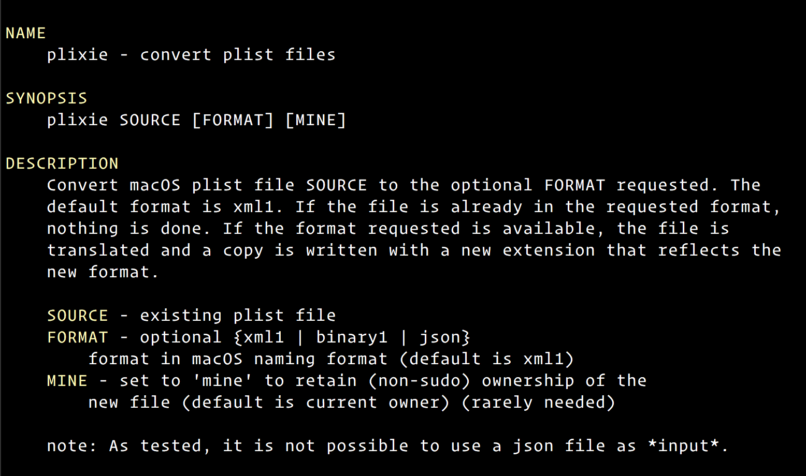

# plixie version 1.0.0

[](https://app.netlify.com/sites/mystifying-keller-ab5658/deploys) 


 

Last update: 06-24-2019 | 23:52:52



---

### Convert macOS plist file SOURCE to the optional FORMAT requested.

```bash

###############################################################################
# plixie : Convert macOS plist file SOURCE to the optional FORMAT requested. (version 1.0.0)
#
# author    - Michael Treanor  <skeptycal@gmail.com>
# copyright - 2019 (c) Michael Treanor
# license   - MIT <https://opensource.org/licenses/MIT>
# github    - https://www.github.com/skeptycal
#
# NAME
#     plixie - convert plist files

# SYNOPSIS
#     plixie SOURCE [FORMAT] [MINE]

# DESCRIPTION
#     Convert macOS plist file SOURCE to the optional FORMAT requested. The
#     default format is xml1. If the file is already in the requested format,
#     nothing is done. If the format requested is available, the file is
#     translated and a copy is written with a new extension that reflects the
#     new format.

#     SOURCE - existing plist file
#     FORMAT - optional {xml1 | binary1 | json}
#         format in macOS naming format (default is xml1)
#     MINE - set to 'mine' to retain (non-sudo) ownership of the
#         new file (default is current owner) (rarely needed)

#     note: As tested, it is not possible to use a json file as *input*.


#
#   .pre-commit-template.yaml must be in current directory
#       If not, a generic template will be created
#   .pre-commit-bak.yaml will be created (if possible)
#       from .pre-commit-config.yaml as backup
#   .pre-commit-config.yaml will be *overwritten*
#       and updated to current master sha from GitHub
###############################################################################


# Run this script if changes to the pre-commit or yaml configuration are added.

# Please make changes directly to the 'template' file:
#     <.pre\-commit-template.yaml>
# and run the script 'pc' to update the yaml to current versioning.

# Please do not make changes directly to the 'config' file. The 'config' file:
#     <.pre-commit-config.yaml>
#   is created and updated by the 'pc' script automatically in order to maintain
#   the correct, current versioning from git (master sha) so changes to the
#   commit file will be overwritten when updating.
###############################################################################


```

---

```bash
.
├── AUTHORS
├── README.md
├── bak
│   ├── LICENSE.bak
│   ├── pipfile
│   ├── plist.py
│   ├── plist_xml.sh.old
│   ├── readme.template.md
│   ├── script_example.md
│   └── setup.py
├── bitbucket-pipelines.yml
├── code-of-conduct.md
├── codecov.yml
├── examples
│   ├── small_list.txt
│   ├── test.plist
│   ├── test.plist.bak
│   ├── test.plist.binary1
│   ├── test.plist.json
│   ├── test.plist.original
│   └── test.plist.xml1
├── gpg_public.txt
├── license
└── plixie

2 directories, 22 files
```
